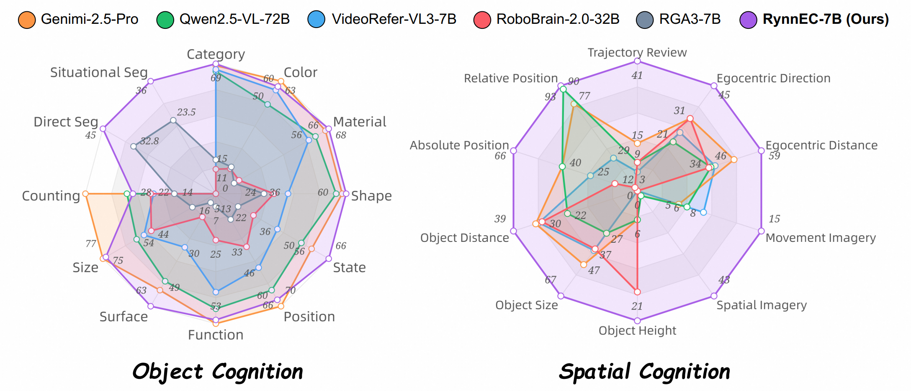

<p align="center">
    
<p>

<h3 align="center"><a href="" style="color:#9C276A">
RynnEC: Bringing MLLMs into Embodied World</a></h3>
<h5 align="center"> If our project helps you, please give us a star ⭐ on GitHub to support us. 🙏🙏 </h2>


<h5 align="center">

[](https://github.com/DAMO-NLP-SG/VideoLLaMA3/blob/main/LICENSE) 
[]()
[](https://huggingface.co/collections/DAMO-NLP-SG/videollama3-678cdda9281a0e32fe79af15) 
[](https://huggingface.co/collections/DAMO-NLP-SG/videollama3-678cdda9281a0e32fe79af15)
<br>
[](https://huggingface.co/papers/2501.13106)
[](https://arxiv.org/abs/2501.13106) 
</h5>


## 📰 News


## 🌟 Introduction
**RynnEC** is a video multi-modal large language model (MLLM) specifically designed for embodied cognition
tasks. 

<p align="center">
    
<p>


## 🛠️ Requirements and Installation

Basic Dependencies:

* Python >= 3.10
* Pytorch >= 2.4.0
* CUDA Version >= 11.8
* transformers >= 4.46.3

Install required packages:


```bash
git clone https://github.com/alibaba-damo-academy/RynnEC
cd RynnEC
pip install -r requirements.txt
pip install flash-attn --no-build-isolation
```

## 🌎 Model Zoo

| Model                | Base Model   | HF Link                                                      |
| -------------------- | ------------ | ------------------------------------------------------------ |
| RynnEC-2B       | Qwen2.5-1.5B   | [Alibaba-DAMO-Academy/RynnEC-2B](https://huggingface.co/Alibaba-DAMO-Academy/RynnEC-2B) |


### CookBook
Checkout [inference notebooks](inference/notebooks/) that demonstrate how to use RynnEC on various applications such as basic object understanding, spatial understanding and video object segmentation in egocentric world.

| Notebooks                | Description   |
| :-------------------- | ------------------------------------------------------------------------ |
| [Object Understanding](inference/notebooks/1.object_understanding.ipynb)      | Demonstrates how to use RynnEC for **general object recognition and understanding** |
| [Spatial Understanding](inference/notebooks/2.spatial_understanding.ipynb)       | Demonstrations of using RynnEC for **spatial understanding** with 3D awareness|
| [Video Object Segmentation](inference/notebooks/3.object_segmentation.ipynb) | Demonstrations of using RynnEC for **video object segmentation** with text-based instructions|


## 🤗 Demo

It is highly recommended to try our [online demo]() first.

Otherwise, you can launch a gradio app locally:

```bash
python inference/gradio_demo.py --model-path Alibaba-DAMO-Academy/RynnEC-2B

options:
  --model-path MODEL_PATH, --model_path MODEL_PATH
  --port SERVER_PORT, --server_port SERVER_PORT
  	Optional. Port of the model server.
```


## 🕹️ RynnEC-Bench
RynnEC-Bench evaluates the models in two key areas: `object cognition` and `spatial cognition`, evaluating a total of `42` embodied cognitive abilities.

<p align="center">
    
<p>

For more details, please refer to [RynnEC-Bench](benchmark/readme.md).


## ✅ Evaluation

### 1.RynnEC-Bench
Please prepare the datasets and question files used for evaluation [here](benchmark/readme.md).

```bash
# for object property cognition
bash evaluation/eval_object_property.sh

# for object segmentation
bash evaluation/eval_seg.sh

# for spatial cognition
bash evaluation/eval_spatial.sh
```

Note:

Fill in the API_KEY, URL in the [metrics.py](evaluation/metrics.py) first.


## 📑 Citation

If you find RynnEC useful for your research and applications, please cite using this BibTeX:


## 👍 Acknowledgement
Our RynnEC is built on top of [**VideoLLaMA3**](https://github.com/DAMO-NLP-SG/VideoLLaMA3). We also learned a lot from the implementation of [**VideoRefer**](https://github.com/DAMO-NLP-SG/VideoRefer), [**Sa2VA**](https://github.com/magic-research/Sa2VA), and [**Qwen2VL**](https://github.com/QwenLM/Qwen2-VL). Besides, our VideoLLaMA3 benefits from tons of open-source efforts. If your work is used in RynnEC but not mentioned in either this repo or the technical report, feel free to let us know :heart:.


## 🔒 License

This project is released under the Apache 2.0 license as found in the LICENSE file.
The service is a research preview intended for **non-commercial use ONLY**, subject to the model Licenses of Qwen, Terms of Use of the data generated by OpenAI and Gemini, and Privacy Practices of ShareGPT. Please get in touch with us if you find any potential violations.
